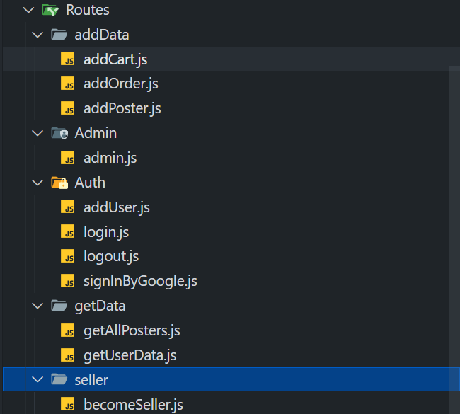
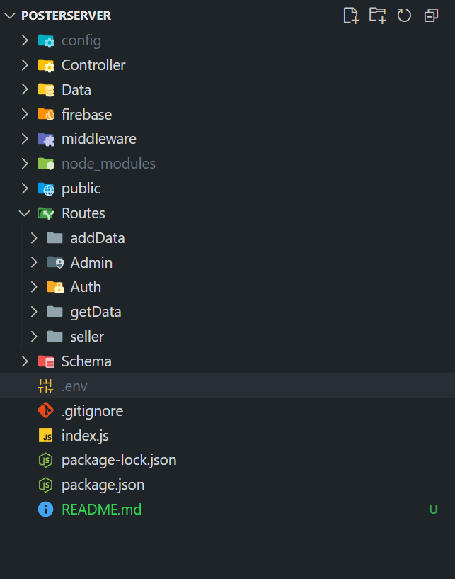

# 🖼️ Poster E-commerce Backend

An Express.js backend application for managing posters, users, carts, and orders. Built as the backend service of a full-stack e-commerce platform for selling posters.



---

## 🚀 Features

- 🔐 User authentication and management
- 🎨 Poster upload, retrieval, update, and deletion
- 🛒 Cart operations (add/remove posters)
- 📦 Order placement and tracking
- 🌐 REST API architecture
- 🧾 JSON-based request and response format

---

## 🧑‍💻 Tech Stack

- **Node.js**
- **Express.js**
- **MongoDB + Mongoose**
- **CORS**
- **dotenv**

---

## 📁 Project Structure




---

## ⚙️ Getting Started

### 1. Clone the Repository

```bash
git clone https://github.com/devesh-0419/Postersell.git
cd Postersell
```
### 2. Install Dependencies

```bash
npm install
```
### 3. Create a .env File

```bash
PORT=5000
MONGO_URI=your_mongodb_connection_string
```
### 4. Start the Server

```bash
npm start
```

| Route         | Method                         | Description                              |
| ------------- | ------------------------------ | ---------------------------------------- |
| `/api/user`   | `POST`, `GET`                  | Register and login users                 |
| `/api/poster` | `POST`, `GET`, `PUT`, `DELETE` | Create, fetch, update, or delete posters |
| `/api/cart`   | `POST`, `GET`, `DELETE`        | Add or remove posters from cart          |
| `/api/order`  | `POST`, `GET`                  | Place and view orders                    |


🧪 Testing the API

Use Postman to test API routes.